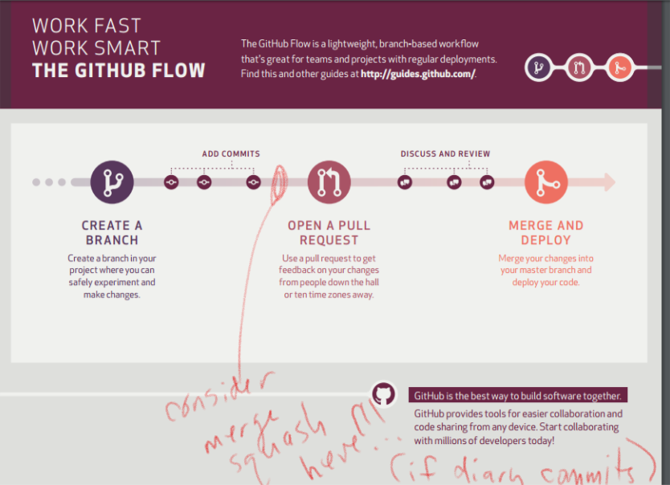

# GitHub Flow ++

## GitHub Flow + Crafting Perfect Pull Requests + Presenting Your Code

**A great way for teams to use Git!!!**

---
 
Basically **GitHub Flow** well documented here
 
[GitHub Flow Documentation](https://guides.github.com/introduction/flow/index.html])
 
With optional, but recommended, merge squashes used to **craft the perfect pull request!**
 
Merge squash especially useful if **diary commits** are used. And I believe they should be encouraged. Change something, comment and commit. Then do it again. 
 
There’s maybe some sort of TDD red-green-refactor analogy here. CCC – Change, comment, commit. Or C4 “Change, comment, commit, ceremony.” Just feels **rhythmic** to me. I love it!!!
 
I’m constantly rewarded for this technique when asked to look at a different branch and not having to worry about what I was working on in my current branch. It has more than likely been committed and pushed or backed-up making it easy to change away from it.
 

 
Then the question of who can accept pull request. 
 
Maybe 4 amigos initially (Nate, Justin, Ben, Derek). Maybe all 4 each time for the first ones! Maybe always whole team!
 
But important to not just look at the code. Rather, the person, or team representative, or whole team should **present their perfectly crafted pull request**.
 
This is where high-level **important concepts** and **approaches taken** can be **communicated in words** making sure everyone has a **shared understanding**. And benefiting from the **right people hearing potential dangerous or harmful things**. Rather than hoping somebody sees it while reviewing code by themselves.
 
Initially everyone will struggle with presenting their code, but it is a skill worth mastering! I’ve often thought this akin to residents (doctors) presenting to their attending physician. Strangely rewarding analogy given our healthcare market ; - )
 
There is great benefit in asking a few questions about an approach or technique. Often the person presenting will discover they have remnants of two approaches they were considering. Or “never thought of that.” All contributing to better code base!
 
Then merge in the perfect pull request and party on!
 
A few things I haven’t thought too much about (yet) in our environment include:
 
* Which branches do we apply this to. GitHub flow treats ‘master’ as the gold standard. We may want/need to alter that a bit. Or maybe not. I have previously thought our branching strategy could be altered and still support the goals of Jenkin builds and various deployment environments.
 
* Possibly allowing pull requests to be submitted before presenting so that they can be rejected right away if they are not clean (perfect). I feel this might help evolve toward this from the current mass merge approach. And move everyone toward crafting commits and pull requests!
 
Thanks,

Tom
